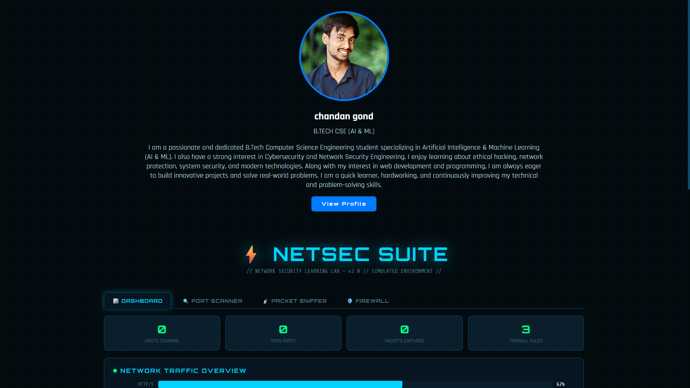
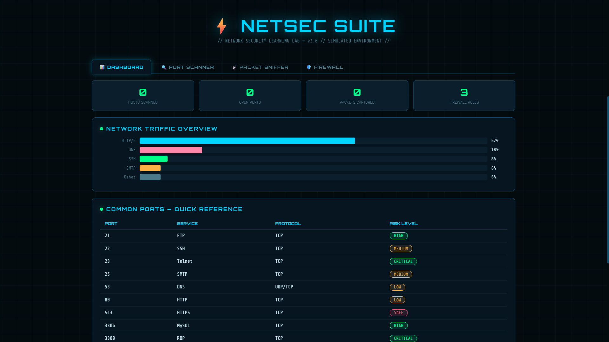
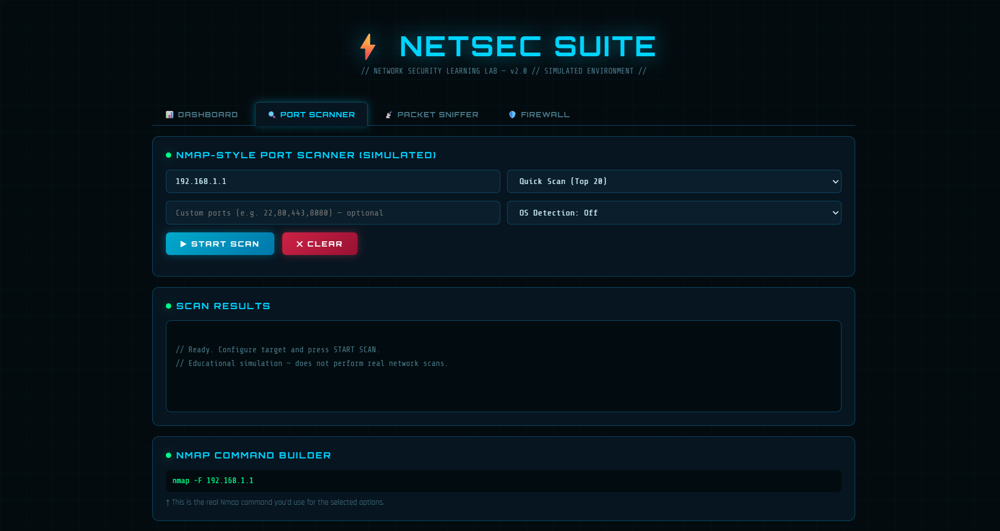
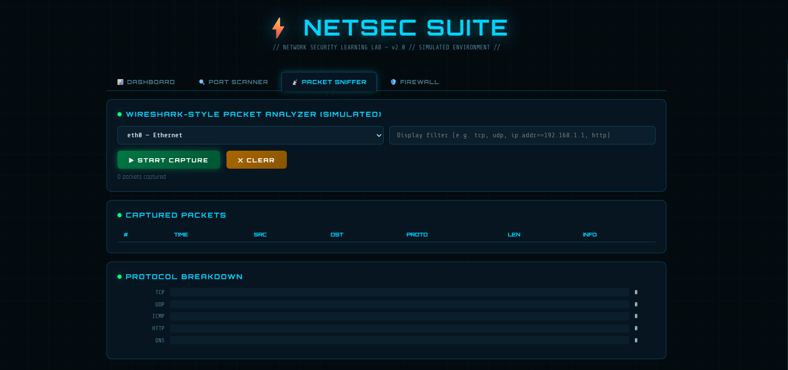
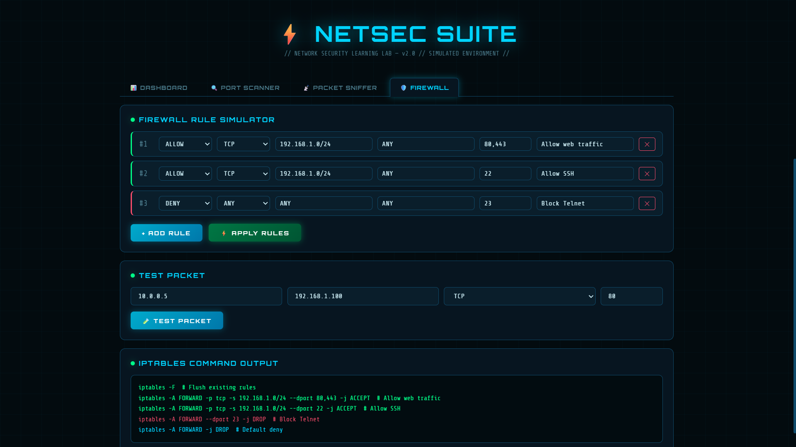

# 🛡️ NETSEC SUITE

NETSEC SUITE is an advanced cybersecurity and network security platform designed to monitor, analyze, and secure digital systems through powerful security tools and real-time threat detection. The project provides an integrated environment for ethical hacking, network monitoring, and cybersecurity analysis with a modern and user-friendly interface.

---

## 🚀 Features

### 📊 DASHBOARD
Interactive security dashboard that provides real-time monitoring of network activity, system status, security alerts, and threat analysis in a centralized interface.

### 🔍 PORT SCANNER
Scans open ports and detects active services running on target systems to identify potential security vulnerabilities and exposed network endpoints.

### 📡 PACKET SNIFFER
Captures and analyzes network packets in real time to monitor traffic flow, inspect protocols, and detect suspicious activities across the network.

### 🛡️ FIREWALL
Implements network filtering and access control mechanisms to block unauthorized traffic, enhance system protection, and secure network communication.

---

## 💻 Technologies Used

- HTML5
- CSS3
- JavaScript

---

## 🎯 Objective
The main objective of NETSEC SUITE is to provide a centralized cybersecurity toolkit for network monitoring, vulnerability detection, and system protection while improving cybersecurity awareness and practical security analysis skills.

 
 

 
 

 
 

 
 

